# The hiking project

This app will be able to store your favorites trails ! This website must be collaborative. It means that users can connect & add their own hikes. Help hikers to connect each others for building a better world.

## The home page :
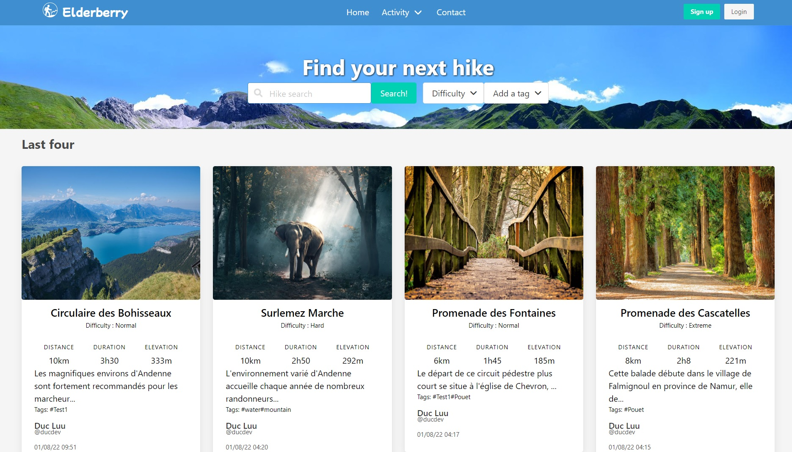

## User must signed up before add or edit a hike :
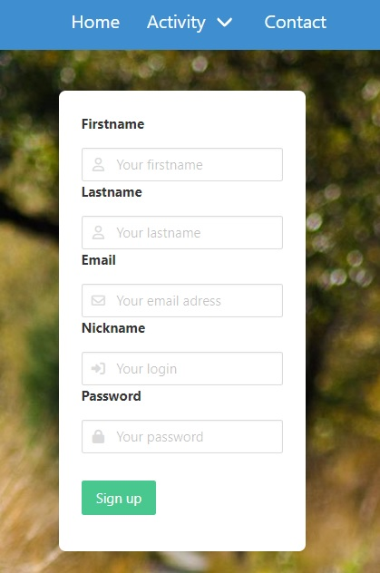
## Welcome new member ! :
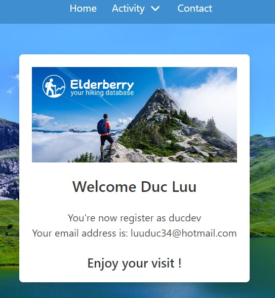

## Login page, if already signed up :
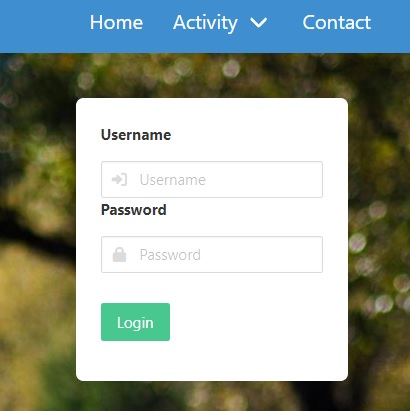

## Show all hikes (no need to subscribe to access) :
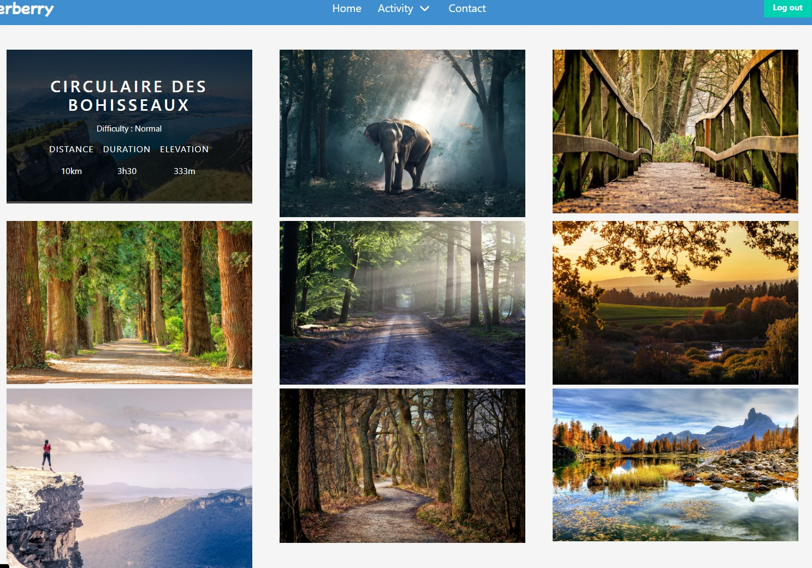

## Single hike page (when choose a hike from all hikes page) :
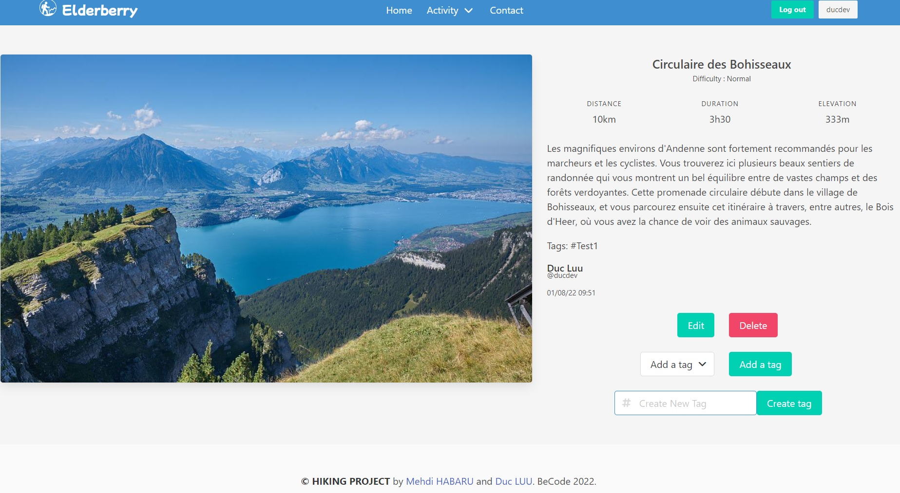
In the single hike view, user can edit or delete his own hike and join a tag on it.

## My hikes page :
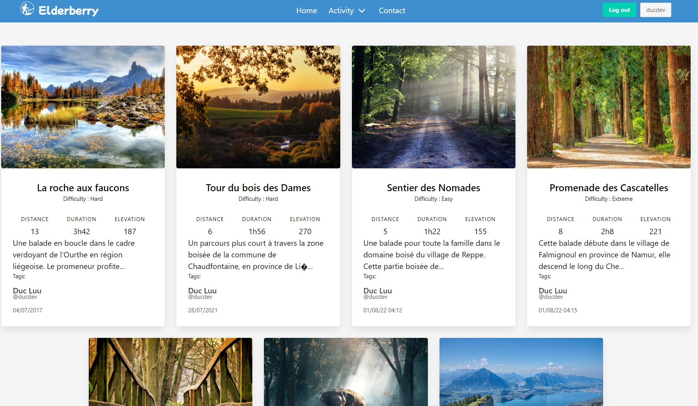
Here is all of yours own hikes.

### Add hike :
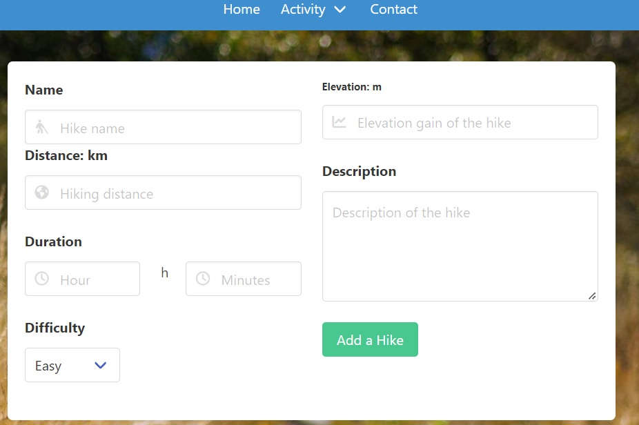
In this page, user can add new hike.

## User profile :
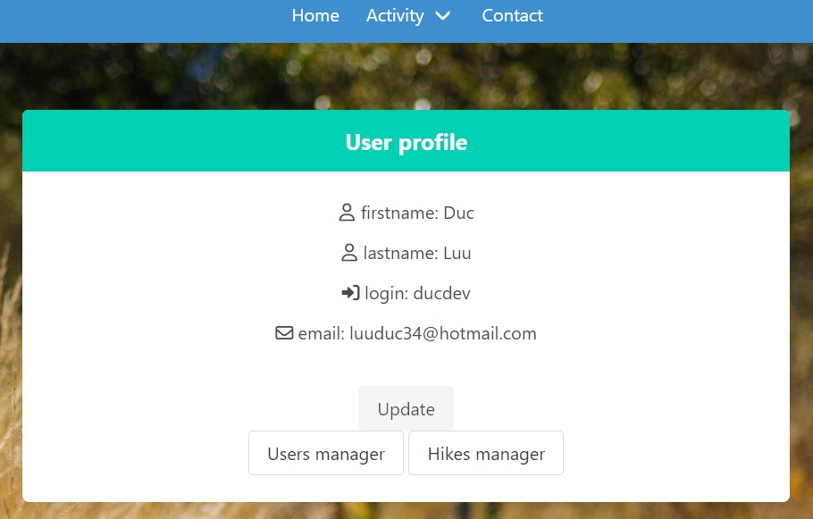
This page show the user's profile and he can update it.

## User management (if you are administrator) :
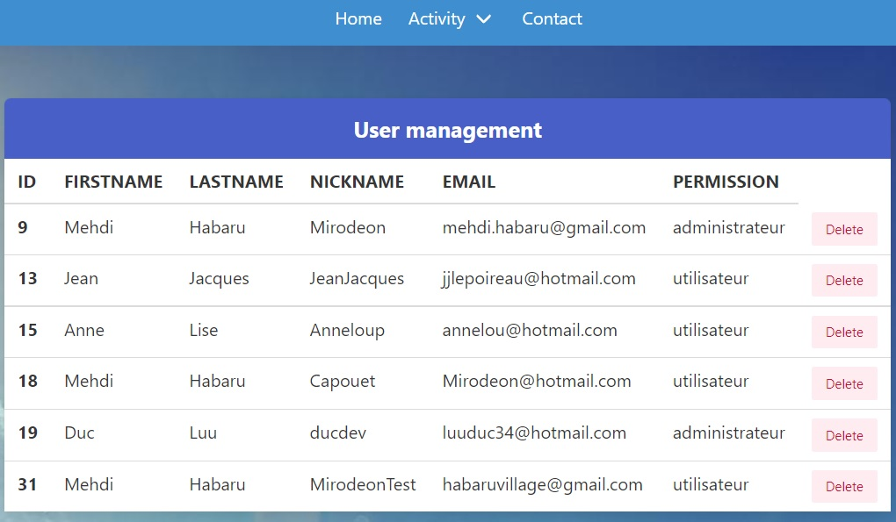
Only administrator can access this page. He can delete user(s)

## Hike management (if you are administrator) :
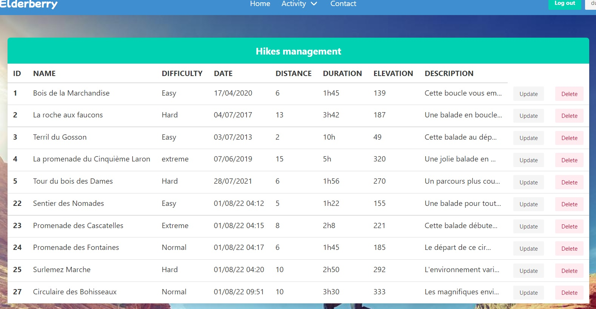
In the same way of user management page, administrator can edit or delete hike(s)

## Contact page :
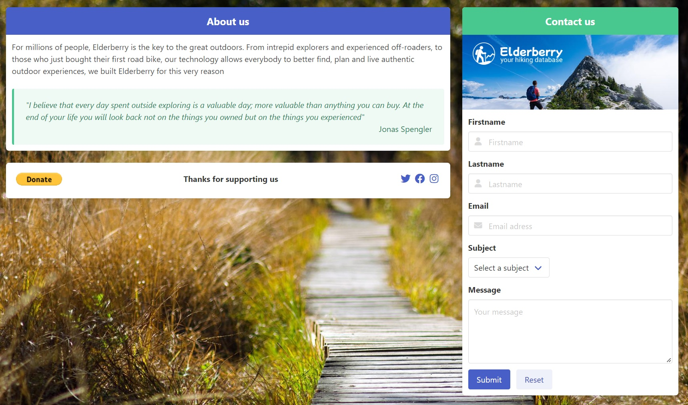
Some about us and if you have to contact us, it's the right place.

## Goals of this challenge :

- Project planning.
- Mock-up creation.
- semantical HTML.
- Database creation.
- Creation of dynamic website.
- Secure programming (with nice errors messages).
- Use a router.
- OOP.
- MVC architecture.
- Agile methodology.

## Link to the website

[Elderberry Hiking Project](https://hiking-project-becode2022.herokuapp.com/)

## Authors

- [Mehdi Habaru](https://github.com/Mirodeon)

- [Duc Luu](https://github.com/luuduc34)

## Language used

Javascript, HTML, CSS(Bulma framework), PHP
